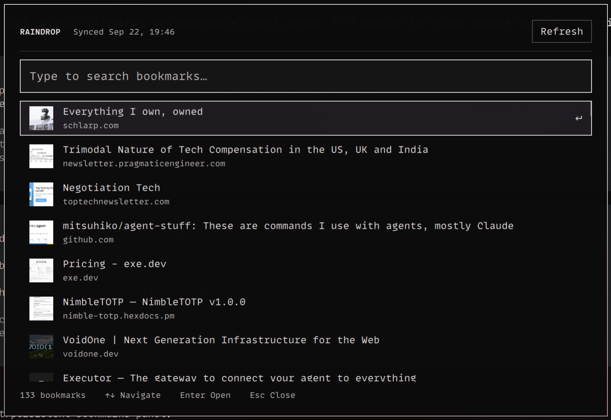

# Raindrop Bookmarks for Omarchy

A keyboard-first Omarchy Quattro overlay for searching your
[Raindrop.io](https://raindrop.io/) bookmarks. It keeps the last successful
bookmark download for offline search, caches small cover thumbnails, and uses a
letter tile when a bookmark has no usable cover.



## Requirements

- Omarchy Quattro
- `curl`, `jq`, `file`, `python3`, `timeout`, and ImageMagick's `magick`

Install the required packages:

```sh
omarchy pkg add jq imagemagick python
```

## Install

```sh
omarchy plugin add https://github.com/treramey/omarchy-raindrop-bookmarks.git --enable
```

Open the overlay and paste your Raindrop test token when prompted. The plugin
links to the Raindrop integrations menu, verifies the token, and stores it at
`~/.config/raindrop/token` with private permissions.

To open the overlay from a terminal:

```sh
omarchy-shell shell toggle io.github.treramey.raindrop-bookmarks '{}'
```

To store the token elsewhere, set `RAINDROP_TOKEN_FILE` before you start
Omarchy Shell.

## Keyboard shortcut

To use `Super + Shift + R`, add this binding to
`~/.config/hypr/bindings.lua`:

```lua
hl.unbind("SUPER + SHIFT + R")
o.bind(
  "SUPER + SHIFT + R",
  "Raindrop bookmarks",
  "omarchy-shell shell toggle io.github.treramey.raindrop-bookmarks '{}'"
)
```

This replaces any existing `Super + Shift + R` binding. Change the key
combination if you already use it, then reload Hyprland:

```sh
hyprctl reload
```

## Use

- Type to fuzzy-search titles, domains, tags, and URLs.
- Use `Up`, `Down`, `Page Up`, and `Page Down` to move through results.
- Press `Enter` to open the selected bookmark.
- Press `Escape` to clear the query, then press it again to close the overlay.
- Click outside the card to close it.
- Use `Refresh` to request a manual bookmark refresh.
- Use `Reconnect` when the saved token is no longer valid.

## Data and security

Omarchy plugins run unsandboxed with your user permissions. This plugin:

- reads only the configured Raindrop token file;
- sends that token only to `https://api.raindrop.io`;
- stores the last complete bookmark response under
  `${XDG_DATA_HOME:-$HOME/.local/share}/omarchy-shell/raindrop-bookmarks`;
- binds saved bookmarks to a local SHA-256 fingerprint of the token without
  storing the token in the snapshot;
- downloads only HTTPS cover URLs on port 443 whose DNS answers are all public;
- pins each cover request to its validated address, disables redirects and
  proxies, and enforces strict connection, transfer-time, and 5 MiB limits;
- accepts only PNG, JPEG, GIF, and WebP covers and processes them under a
  restrictive ImageMagick resource and codec policy;
- stores generated thumbnails under
  `~/.cache/omarchy-shell/raindrop-bookmarks/covers`; and
- opens selected links through `xdg-open`.

The plugin never copies the token into its directory or exposes it in a process
argument. It refreshes cover thumbnails after seven days and removes inactive
thumbnails after 30 days. It refreshes bookmark data in the background when you
open the overlay after five minutes. A failed refresh keeps the last successful
snapshot.

To clear the saved bookmark snapshot and cover cache without removing your
token, run `clear-bookmarks` from the installed plugin directory:

```sh
"${XDG_CONFIG_HOME:-$HOME/.config}/omarchy/plugins/io.github.treramey.raindrop-bookmarks/clear-bookmarks"
```

## Remove

```sh
"${XDG_CONFIG_HOME:-$HOME/.config}/omarchy/plugins/io.github.treramey.raindrop-bookmarks/clear-bookmarks"
omarchy plugin remove io.github.treramey.raindrop-bookmarks
```

The clear command removes the saved snapshot and cover cache. The removal
command leaves `~/.config/raindrop/token` in place because other Raindrop tools
might use it. Remove that file yourself if you no longer need it.

## Development

Test the onboarding flow from the current checkout. The script restores your
installed plugin and token when you finish:

```sh
scripts/test-onboarding.sh
```

Or run the checks directly:

```sh
omarchy plugin validate .
qmllint -I "$OMARCHY_PATH/shell" RaindropBookmarks.qml
bash -n configure-token validate-token token-fingerprint load-bookmarks bookmark-sync clear-bookmarks cover-sync tests/configure-token.sh tests/validate-token.sh tests/bookmark-sync.sh tests/security.sh
tests/configure-token.sh
tests/validate-token.sh
tests/bookmark-sync.sh
tests/security.sh
```

Runtime changes require a Changesets entry (`pnpm changeset`). The release pull
request updates `package.json` and `manifest.json`. Use Conventional Commit
subjects.

Changesets tooling requires `pnpm install`. Its local `node_modules` tree
contains symlinks, which Omarchy's plugin validator intentionally rejects.
Remove it before validating the plugin folder:

```sh
rm -rf node_modules
omarchy plugin validate .
```

See the Omarchy marketplace guides for
[development](https://omarchyplugins.com/develop.html) and
[publishing](https://omarchyplugins.com/publish.html).
